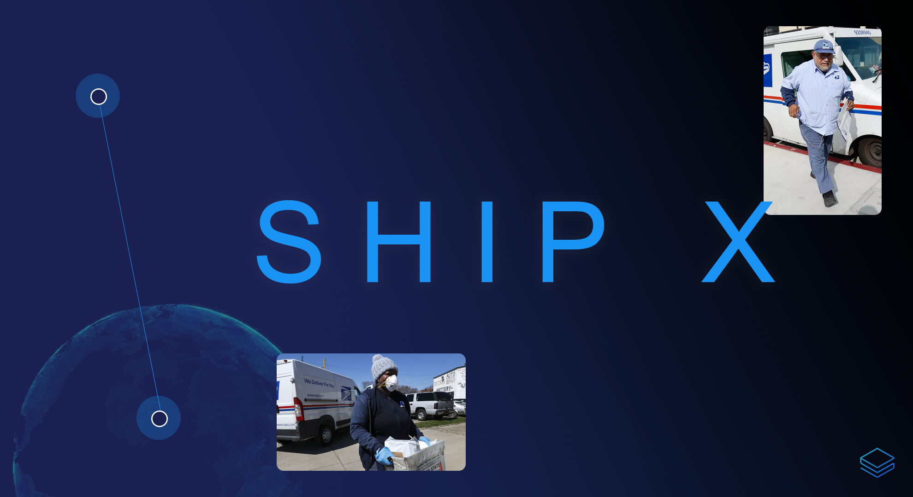

### ShipX: blockchain logistics monitoring for the USPS

True traceability and blockchain-enhanced monitoring will help streamline the technological processes behind the USPS, the big government behemoth awaiting innovation and change through Stratis.

###### Folder Tree:

- `./assets`

- `./pkg`

    reactjs ui to integrate with the testnet node api and smart contract. utilizes the `bitcore-lib` package as well as `web3`.

- `./src`

    c# smart contract built for the Stratis platform, integrated w/ the USPS API

    * xunit, moq for testing

- `./net`

    docker environment and testnet endpoint for the smart contract to interface with.

---

This project is MIT licensed. 

The USPS web tools API portal was used for the logistic service component of the smart contract: https://www.usps.com/business/web-tools-apis/. More documentation can be read at: https://www.usps.com/business/web-tools-apis/address-information-api.htm
